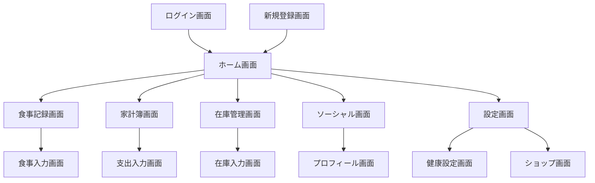

# D110 基本設計書（画面）

## 1. 画面一覧

| 画面ID | 画面名 | 説明 |
| :--- | :--- | :--- |
| S001 | ログイン画面 | メール/パスワード、Googleログイン |
| S002 | 新規登録画面 | アカウント作成、プロフィール設定 |
| S003 | パスワードリセット画面 | パスワード再設定メール送信 |
| S010 | ホーム画面 (ダッシュボード) | 今日のサマリー、クイックアクション |
| S020 | 食事記録画面 | 食事一覧、追加ボタン |
| S021 | 食事入力画面 | 手動入力、バーコードスキャン |
| S030 | 家計簿画面 | 支出一覧、グラフ、予算設定 |
| S031 | 支出入力画面 | 手動入力、レシートスキャン |
| S040 | 在庫管理画面 | 在庫一覧、期限アラート |
| S041 | 在庫入力画面 | 在庫追加・編集 |
| S050 | ソーシャル画面 | タイムライン、投稿作成 |
| S051 | プロフィール画面 | ユーザー情報、投稿履歴 |
| S060 | 設定画面 | アプリ設定、アカウント管理 |
| S061 | 健康設定画面 | 身長・体重設定、Google Fit連携 |
| S070 | ショップ画面 | ポイント交換、着せ替え |

## 2. 画面遷移図

## 3. 共通UI要素
- **ヘッダー**: 画面タイトル、戻るボタン（下層ページ）
- **ボトムナビゲーション**: ホーム、食事、スキャン、レポート、ソーシャル
- **トースト通知**: 処理完了・エラー時のフィードバック
- **モーダル**: 確認ダイアログ、簡易入力フォーム
